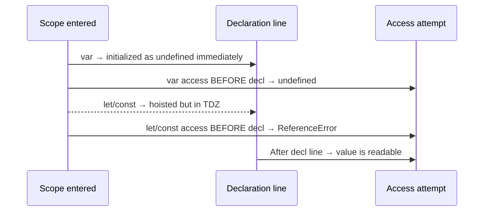

# Chapter 4 — var / let / const, Hoisting & Temporal Dead Zone

This chapter is where SDETs finally stop treating `var`, `let`, and `const` as interchangeable. We cover JavaScript variable declarations, scope rules (function vs block), hoisting behavior, the Temporal Dead Zone (TDZ), re-declaration rules, and why `const` is about binding immutability — not value immutability. Every example is small, runnable, and mapped to a real test-automation pain point.

## Files

| File | Topic | What it shows |
|------|-------|---------------|
| `09_var_let_const.js` | The three declarations | `var` redeclare/reassign, loop counter leak, function basics |
| `10_functions.js` | Function definition vs call | Define once, call many — fundamentals |
| `11_var_explained.js` | `var` is function-scoped | `var a` inside `if (true) {}` still leaks |
| `12_let_peope_love.js` | `let` is block-scoped | Redeclaration error, block-isolated variables |
| `13_const_explained.js` | `const` immutability | Reassignment is a `TypeError` |
| `14_var_functionscope.js` | Function scope walkthrough | Global vs local `var` interplay |
| `15_let_scope.js` | Block scope walkthrough | Same shape as 14, but `let` behaves correctly |
| `16_Hoisting.js` | `var` hoisting | Access before declaration returns `undefined` |
| `17_hoisting_fn.js` | Hoisting inside a function | `var` hoists to function top, not global |
| `18_let_hoisting.js` | `let` + TDZ | `ReferenceError` before initialization |
| `19_let_hoisting_block.js` | Block-level TDZ | Inner `let` shadows outer, TDZ applies in block |
| `20_let_const.js` | `const` + TDZ | `const` is hoisted but un-initialized — TDZ trap |
| `21_Jr_QA.js` | Mini interview-style demo | TDZ on `const API_END_APP_VWO_COM` |

## Concepts covered

- `var` — function-scoped, hoisted to `undefined`, allows re-declaration and re-assignment (a.k.a. "the traitor").
- `let` — block-scoped, hoisted but uninitialized (TDZ), no re-declaration, re-assignment allowed.
- `const` — block-scoped, must be initialized at declaration, binding cannot be re-assigned.
- **Hoisting** — declarations are moved to the top of their scope at compile time; only `var` is auto-initialized to `undefined`.
- **Temporal Dead Zone (TDZ)** — the window between entering a scope and the actual `let`/`const` declaration line. Any access throws `ReferenceError`.
- **Re-declaration rules** — `var` allows it, `let`/`const` throw `SyntaxError`.
- **`const` is about the binding, not the value** — for objects/arrays, properties can still mutate; you just can't re-point the name.

---

### 09_var_let_const.js

Introduces the three declarations and shows the classic `var` loop-counter leak — `i` survives outside the loop.

```js
var v = 10;
let l = 30;
const c = 3.14;

var browser = "chrome";
var browser = "firefox"; // redeclaration allowed
browser = "edge"; // reassignment allowed

var testCases = ["login", "logout", "signup"];

for (var i = 0; i < testCases.length; i++) {
    console.log("Running test:", testCases[i]);
}

console.log("Loop counter leaked outside:", i);
```

```bash
Running test: login
Running test: logout
Running test: signup
Loop counter leaked outside: 3
Hi
Hi
Hi
Hi from Function
Hi from Function
```

### 10_functions.js

Function definition vs invocation — define once, call many times.

```js
function greet() {
    console.log("Hi, How are you?");
}

greet();
greet();
greet();
```

```bash
Hi, How are you?
Hi, How are you?
Hi, How are you?
(... 7 times total)
```

### 11_var_explained.js

`var` is function-scoped — the `if` block does NOT create a new scope for `var`.

```js
var a = 10;// Global SCOPE

console.log(a);

function printHello() {
    console.log("Hello TheTestingAcademy!");
    var a = 20; // Local Scope
    console.log(a);
    if (true) {
        var a = 30;
        console.log(a); // 30
    }
}

printHello();

var a = 50;
```

```bash
10
Hello TheTestingAcademy!
20
30
```

### 12_let_peope_love.js

`let` is block-scoped; re-declaration is illegal; access outside the block fails.

```js
let a = 10;

let retryCount = 0;
retryCount = retryCount + 1;
retryCount = retryCount + 1;
console.log("Retry attempt:", retryCount);

let testStatus = "pending";

if (testStatus === "pending") {
    let executionTime = 1200;
    console.log("Inside block:", executionTime);   // 1200
}

console.log(executionTime); // ReferenceError: executionTime is not defined
```

```bash
Retry attempt: 2
Inside block: 1200
ReferenceError: executionTime is not defined
```

### 13_const_explained.js

`const` binding cannot be re-assigned — TypeError on attempt.

```js
const BASE_URL = "https://app.thetestingacademy.com";
// BASE_URL = "https://staging.thetestingacademy.com";
// TypeError: Assignment to constant variable.

let name = "pending";
name = "done";
{
    let name = "Dutta";
}

function say() {
    let name = "Dutta";
}
say();
say();
```

```bash
(no output — variables declared/assigned silently)
```

### 14_var_functionscope.js

A clean walk-through of `var` global + nested function scope.

```js
var a = 10; // Global Scope
console.log(a);
function printHello() {
    console.log("Hello TheTestingAcademy!");
    var a = 20; // Local Scope
    console.log(a);
    if (true) {
        var a = 30;
        console.log(a); // 30
    }
    console.log("F ->", a);
}

console.log("G ->", a);

printHello();
```

```bash
10
G -> 10
Hello TheTestingAcademy!
20
30
F -> 30
```

### 15_let_scope.js

Same structure, `let` instead of `var` — now block scope behaves sanely.

```js
let a = 10; // Global Scope
console.log(a);
function printHello() {
    console.log("Hello TheTestingAcademy!");
    let a = 20; // Local Scope
    console.log(a);
    if (true) {
        let a = 30;
        console.log(a); // 30
    }
    console.log("F ->", a);
}

console.log("G ->", a);

printHello();
```

```bash
10
G -> 10
Hello TheTestingAcademy!
20
30
F -> 20
```

### 16_Hoisting.js

`var` is hoisted and pre-initialized to `undefined`.

```js
console.log(greeting);
var greeting = "Hello";
console.log(greeting);

console.log(a);
var a = "Pramod";
console.log(a);
```

```bash
undefined
Hello
undefined
Pramod
```

### 17_hoisting_fn.js

`var` hoists to the **function** top, not the global scope.

```js
function getUserStatus() {
    console.log(status_code);
    var status_code = "Active";
    console.log(status_code);
}

getUserStatus();
```

```bash
undefined
Active
```

### 18_let_hoisting.js

`let` is hoisted too — but uninitialized. Welcome to the TDZ.

```js
console.log(score); // ReferenceError: Cannot access 'score' before initialization
let score = 100;
```

```bash
ReferenceError: Cannot access 'score' before initialization
```

### 19_let_hoisting_block.js

Block-scope shadowing creates a fresh TDZ inside the block — even though an outer `x` exists.

```js
let x = "global";

if (true) {
    // TDZ for block-scoped "x" starts here
    // console.log(x);   // ReferenceError (NOT "global"!)
    let x = "block";     // TDZ ends
    console.log(x);      // "block"
}

console.log(x);
```

```bash
block
global
```

### 20_let_const.js

`const` is hoisted but uninitialized — accessing before declaration throws.

```js
console.log(c);
console.log("Hei");
const c = "pramod;"
```

```bash
ReferenceError: Cannot access 'c' before initialization
```

### 21_Jr_QA.js

Classic junior-QA interview trap — looks innocent, blows up on line 1.

```js
console.log(API_END_APP_VWO_COM);
console.log("dasda")
if (true) {

}

const API_END_APP_VWO_COM = "https://app.vwo.com/login/api";
```

```bash
ReferenceError: Cannot access 'API_END_APP_VWO_COM' before initialization
```

---

## TDZ — visual



| Declaration | Access before declaration line |
|-------------|--------------------------------|
| `var x`     | `undefined`                    |
| `let x`     | `ReferenceError` (TDZ)         |
| `const x`   | `ReferenceError` (TDZ)         |

## `var` vs `let` vs `const`

| Feature           | `var`                 | `let`                  | `const`                |
|-------------------|-----------------------|------------------------|------------------------|
| Scope             | Function              | Block `{}`             | Block `{}`             |
| Hoisting          | Yes — init `undefined`| Yes — TDZ              | Yes — TDZ              |
| Re-declaration    | Allowed               | `SyntaxError`          | `SyntaxError`          |
| Re-assignment     | Allowed               | Allowed                | `TypeError`            |
| Must initialize?  | No                    | No                     | Yes (at declaration)   |
| Global → window?  | Yes (in browser)      | No                     | No                     |

## How to run

```bash
node chapter_04_Javascript_Concepts/09_var_let_const.js
node chapter_04_Javascript_Concepts/16_Hoisting.js
node chapter_04_Javascript_Concepts/18_let_hoisting.js
# ...and so on for each file
```

## Takeaway

Default to `const`, reach for `let` only when you must re-assign, and treat `var` as legacy. Once TDZ clicks, half of "weird JS bugs" in your Playwright tests stop being weird.
